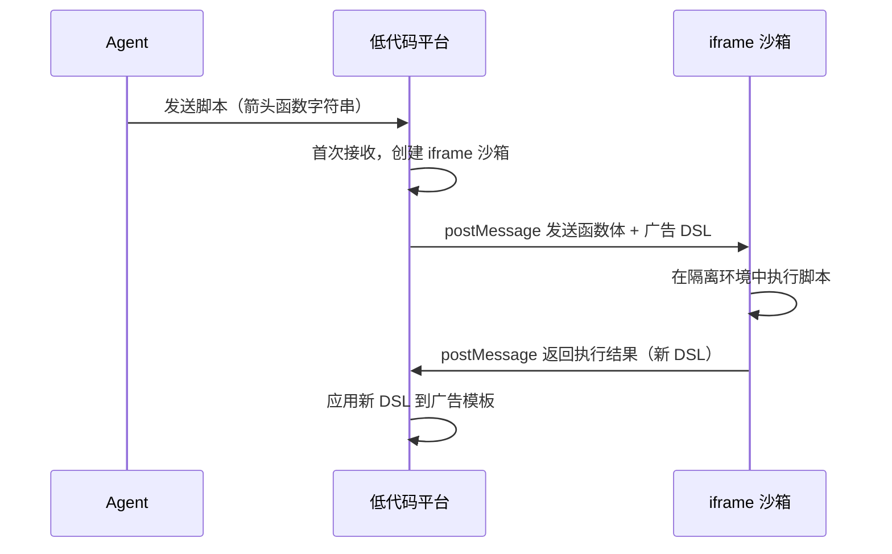

## Programmatic Tool Calling

这两天刷到 B 站有个数字人 UP 讲了 Anthropic 提出的一个新的概念 —— [Programmatic Tool Calling](https://platform.claude.com/docs/en/agents-and-tools/tool-use/programmatic-tool-calling)，惊觉发现这跟我之前一直在做的一个 Agent 项目的优化思路很像。

> Programmatic tool calling allows Claude to write code that calls your tools programmatically within a code execution container, rather than requiring round trips through the model for each tool invocation. This reduces latency for multi-tool workflows and decreases token consumption by allowing Claude to filter or process data before it reaches the model's context window.

大致意思就是在使用 Tool Calling 时，让 AI 生成一份可编排多工具调用的 Python 代码，在安全沙箱中一次性完成多步工具调用、数据处理与逻辑判断，仅需 1 次模型推理往返，实测可减少约 37% 的 token 消耗，大幅降低延迟。

### 示例

可以直接看下官方给的例子：

```typescript
const response = await anthropic.messages.create({
  model: "claude-opus-4-6",
  max_tokens: 4096,
  messages: [
    {
      role: "user",
      content:
        "Query customer purchase history from the last quarter and identify our top 5 customers by revenue",
    },
  ],
  tools: [
    {
      type: "code_execution_20260120",
      name: "code_execution",
    },
    {
      name: "query_database",
      description:
        "Execute a SQL query against the sales database. Returns a list of rows as JSON objects.",
      input_schema: {
        // ...
      },
      allowed_callers: ["code_execution_20260120"],
    },
  ],
});
```

这个例子的大致流程是：用户提问"查询上季度的客户购买历史，找出收入最高的前 5 名客户"。Claude 拿到请求后，没有一步步发起多次工具调用，而是直接生成了一段 Python 代码，在沙箱中调用 `query_database` 工具执行 SQL，拿到返回结果后，**在代码里直接完成排序和切片**，最终输出 Top 5。整个过程只有 1 次模型推理往返，数据的过滤和聚合都在沙箱里完成，不会塞回模型的 context window。

可以看到 response 里有个关键字段 `allowed_callers: ["code_execution_20260120"]`，这表示 `query_database` 这个工具**只允许被 code_execution 沙箱调用**，而不能被 Claude 直接调用。这是一个安全机制，确保工具的调用路径是可控的。

```json
{
  "role": "assistant",
  "content": [
    {
      "type": "text",
      "text": "I'll query the purchase history and analyze the results."
    },
    {
      "type": "server_tool_use",
      "id": "srvtoolu_abc123",
      "name": "code_execution",
      "input": {
        "code": "results = await query_database('<sql>')\ntop_customers = sorted(results, key=lambda x: x['revenue'], reverse=True)[:5]\nprint(f'Top 5 customers: {top_customers}')"
      }
    },
    {
      "type": "tool_use",
      "id": "toolu_def456",
      "name": "query_database",
      "input": { "sql": "<sql>" },
      "caller": {
        "type": "code_execution_20260120",
        "tool_id": "srvtoolu_abc123"
      }
    }
  ],
  "container": {
    "id": "container_xyz789",
    "expires_at": "2025-01-15T14:30:00Z"
  },
  "stop_reason": "tool_use"
}
```

### 优势

普通 Tool Calling 的问题在于，每调用一次工具就得往返模型一次：工具结果塞回 context，模型再决定下一步，如此循环。工具越多、数据越大，往返次数和 token 消耗就越离谱。

PTC 的核心改变是**把"编排逻辑"从模型推理中剥离出来，交给代码执行**：

- **延迟更低**：多个工具调用在沙箱内顺序或并发执行，不需要每次都绕回模型，整体 RTT 大幅缩短。
- **token 消耗更少**：中间产生的大量原始数据（比如数据库返回的几千行记录）在沙箱里直接处理掉，只有最终结果才进入模型的 context window，官方给出的数字是减少约 37%。

## Tools 设计风格的进化

### 业务函数风格

OpenAI 最早支持了 function calling，这算是最初的 tool calling。

这时的 tools 设计比较简单，每个工具都是一个类似传统互联网的业务接口，其高度封装用来做一些特定的事情。比如增删改查。

### Agent 时代的工具设计

在 Manus、Claude Code 等 AI Agent 大火之后，一种为 Agent 设计 tools 而不是传统的为人设计的风格开始出现。

对于 Agent 来说，较少、通用的工具更符合其设计目标，而不是数量多但精细的设计。

这一方面是因为 Agent 的底座模型的逻辑推理能力越来越强，能够处理复杂的任务逻辑，其次是其 Context Window 并没有和模型能力以及工具膨胀速度成线性关系，所以裁剪工具数量是必要的。

所以，类似 `bash` 这类的工具火了，因为它是一个通用的工具，能够完成很多任务。你可以编写及其复杂的脚本来完成一个复杂的任务，而在之前的时代，大家可能更倾向于设计 `start_server` 这类专用的工具，但是现在，Agent 完全可以使用 `bash` 启动一个服务。

**个人认为，这就是 PTC 的雏形或者说是一种。**

### PTC

所以，PTC 和 `bash` 这种工具的思想是一脉相承的，比如上述 case 中查询数据库，我们可以直接在代码里写 SQL，而不是设计一大堆增删改查工具让模型来进行多轮调用。

## 个人工作中的 PTC 实践

我自己最近半年主要负责的一个 Agent 应用，在设计 Tools 的过程中，也走了上述的这条优化路径。

这个 Agent 应用的定位是一个「**广告模板助手**」，其能够解答或者完成任何有关广告模板的问题和任务。
它不是独立应用，而是寄生在原有的广告模板低代码编辑平台上，进一步降低了平台的使用和理解成本。

名词解释：

- **广告模板**：可以认为是展示的广告的内容，其内部可能包含了广告的标题、描述、图片等元素；
- **DSL**：私域的 JSON 格式的语言，可描述广告模板的 UI/交互事件/动画等，最终会被端侧广告 SDK 的渲染引擎消费。

### Phase 1. 业务接口设计

最初设计了如下的的 Tools：

- 读工具：查模版 DSL、模板中的节点、当前已经打开的模板等工具，类似常见业务接口的查询接口，这里不再详细赘述
- 写工具：
  - 增：包括「添加 DSL 节点」和「批量添加节点」
  - 删：包括「删除 DSL 节点」和「批量删除节点」
  - 改：包括「替换当前模板」和「批量替换模板」，「更新 DSL 节点属性」和「批量更新节点属性」，「替换 DSL 节点」和「批量替换节点」

当时从传统业务刚刚转到开始设计 Agent，所以思想比较 old school，照着**传统互联网的业务接口设计思想**来设计了 Agent 的 Tools。

### Phase 2. PTC 风格重构

随着自己对 Agent 尤其是 Coding Agent 设计的思想的不断深入了解和思考，我开始思考并重构整个 Tools 设计。

之前头脑一直固化地认为这个平台是一个传统业务 + AI 提效，但是后来我想通了，这其实就是一个 AI Coding Agent，能够根据用户的要求来改 JSON 代码。

于是，我决定摒弃增删改查的思想，将写工具进行一次完全的重构，直接给 AI 足够的上下文，然后让它编写脚本来任意的操作 JSON（DSL）就可以解决所有问题。

这与上面的 PTC 思想不谋而合，**不过当时 Anthropic 还没有提出 PTC 这个概念**，我其实是受 `bash` 这类工具的启发。

重构后的工具描述：

```json
{
  "capability_name": "update_dsl",
  "description": "更新/修改模板DSL",
  "arguments": {
    "type": "object",
    "properties": {
      "actions": {
        "type": "array",
        "items": {
          "type": "object",
          "properties": {
            "id": {
              "type": "string",
              "description": "要修改的模板ID，注意，只能修改已经打开的模板"
            },
            "callback": {
              "type": "string",
              "description": "要执行的回调函数（箭头函数），为string形式，入参为当前DSL，return最终的DSL，你可以修改DSL后返回或者直接返回新的DSL，如 \"(dsl) => { dsl.children[0].layoutWidth = 123; return dsl }\"，代表修改根节点的第一个子节点的宽度为123"
            }
          }
        },
        "required": ["id", "callback"]
      }
    },
    "required": ["actions"]
  }
}
```

这里的脚本的表现形式是 JS 的箭头函数，入参为当前 DSL，return 最终的 DSL。Agent 可以自由编写代码，实现任意的 DSL 操作。
一个函数就可以搞定单模板/多模板的任意操作，写工具由原有的 10 个裁剪为了 1 个。

同时，由于是脚本，我在当时也设计了**沙箱执行机制**，确保脚本的执行是安全的，不会对用户、平台和广告模板造成意外伤害。

低代码平台在第一次接收到 Agent 发送的脚本后，会启动一个 iframe 沙箱，然后 postMessage 将函数体本身（字符串）和入参（广告 DSL）发送给沙箱，沙箱执行后，将执行结果通过 postMessage 返回给低代码平台，这有效的防止了如果 Agent 生成的脚本存在一些副作用。



同时，受 Claude Code 的 Agentic Search 的启发，新设计了「搜索节点」工具，类似 grep，能够让 Agent 在判断 DSL 过大时，使用搜索来检索相关节点，而不是把整个 DSL 载入到上下文窗口中。

### Phase 3. 畅想：打通一切的 PTC

根据 PTC 的思想，我这里设想了一个更进一步的方案：

Agent 直接编排工具，你定义的任何 tools，无论本地的 `read_file` 或者其他工具，还是 MCP Server 上的工具，都可以被 Agent 按需编排到脚本中。这将作为内化能力，串联起 MCP、skills、工具等。

举一个具体的例子。假设用户说：「把这批模板里的主图全部替换成 AI 生成的春节主题图片，并且同步更新模板标题」。在当前 Phase 2 的架构下，这个任务需要多轮模型推理：先调用搜索工具定位图片节点，再调用外部图片生成 MCP 服务，等图片生成完成后再调用 `update_dsl` 写回模板，每一步都要经过模型。

而在 Phase 3 的设想中，Agent 只需生成一段编排脚本，一次性完成所有操作：

```typescript
// Agent 生成的编排脚本（伪代码）
const templates = await Tools.search_nodes({ query: "主图", type: "image" });

for (const tpl of templates) {
  // 调用 MCP Server 上的 AI 图片生成工具
  const newImage = await MCPTools.image_gen({
    prompt: `春节主题广告图，风格与${tpl.style}一致`,
    size: tpl.imageSize,
  });

  // 调用本地的 update_dsl 工具修改模板
  await Tools.update_dsl({
    id: tpl.templateId,
    callback: (dsl) => {
      const imgNode = dsl.children.find((n) => n.id === tpl.nodeId);
      imgNode.src = newImage.url;
      // 同步更新标题
      const title = dsl.children.find(
        (n) => n.type === "text" && n.role === "title",
      );
      title.content = "🧧 春节特惠 · " + title.content;
      return dsl;
    },
  });
}

console.log(`已完成 ${templates.length} 个模板的主图替换和标题更新`);
```

这段脚本在沙箱中一次性执行，通过 `Tools.*` 和 `MCPTools.*` 前缀区分本地工具和远程 MCP 工具，但**它们被无差别地编排在同一段代码中**，循环、条件判断、字符串拼接等逻辑全部在代码层面完成，不再需要模型来做"胶水"。模型只负责最擅长的事 —— 理解用户意图并生成这段编排代码，而具体的执行和数据流转全部交给沙箱。
